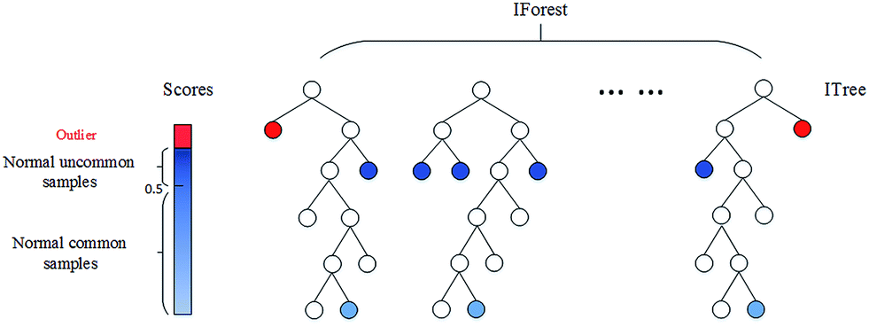
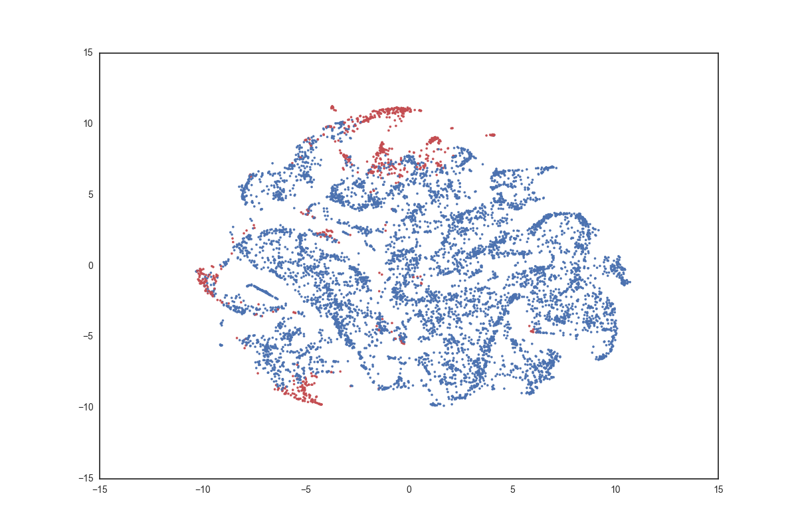

###Abnormality in Non-Profit Financial Data 

####Introduction
Lets assume your a person that wants to donate his entire life savings to charity.  Good for you!

Now the issue is where to donate that money.

There are countless organizations that claim and do perform societal benefits but you want to put your money where it can have the most impact?

Well currently with the data that is collected by non-profit organizations we are not at a place to determine where your dollar may be best utilized. But we may be in a position to determine a group of non-profit organization that you shouldn't donate to.

This project attempts to create an outlier detection model using non-profit financial data to identify higher-risk non-profit organizations.  

####Inspiration and Data
The inspiration for this assessment was the recent release of Non-Profit Financial Data by the IRS.

In June 2016 at the request of congress the IRS released parsable XML files for every nonprofit organization that files a form 990 on Amazon Web Services.

A form 990 is the form that every non-profit organization is required to file in order to maintain its non-profit status. It includes extensive amount of  information on non-profits Assets, Liabilities, Revenues, and Expenses.  It also includes information such as expenses on indoor tanning if your interested.

See the first link below for an example of the form 990 non profits file, second link for an example of the 990 XML files available, and the third link for information for how to pull the files off AWS.

[Form990_File](Form_990Duke.pdf)

[Form990_XML](990sample.xml)

[AWS_Link](https://aws.amazon.com/public-datasets/irs-990/)

####Approach

The approach to this problem was to take all non-profit financial data for ones with above 1,000,000 in revenue and 500,000 in contributions to identify organizations with the primary purpose of obtaining contributions and providing a public service.  Through this we identified nearly 50,000 organizations.  The next step was to create features that if distinctively off would be an indicator or high risk.  The table of features created can be seen below.

Feature | Formula | Interpretation 
----|----|----
Executive Compensation | Officer Compensation/Total Assets | Officier compensation per assets held
Leverage | Total Liabilities/Total Assets | Ratio of Liabilities to Assets 
Solvency | (Total Revenue - Total Expenses + Depreciation) / Total Liabilities | Portion of Liabilities that can be paid in a given year or operations 
Deferred Expenses Ratio | (Prepaid Expenses + Other Assets) / Total Assets | Portion of expenses deferred to the next period 
Deferred Revenues Ratio | Deffered Revenues / Total Revenues | Portion of Revenues deffered to the next period
Depreciation Rate | Depreciation Rate / (Depreciation Rate + Fixed Assets) | Percentage of Fixed assets depreciated
Surplus Margin | (Total Revenue - Total Expenses)/ (Total Revenue) | Income per Revenue
Fundraising Efficiency | Fundraising Income/Fundraising Expenses | Fudraising Income per expenses. 

A note on the features is that the middle three Deffered Expenses Ratio, Deferred Revenues Ratio, and Depreciation Rate are high indicators of accounting manipulation as they are high judgement accounts.

After featurizing the data an Isolation Forest Model was applied (After considering a few models including an SVM Novelty Detection approach, and an elliptic envelope, Isolation Forest model seemed be the best approach).  Here is a link to the paper if you would like to learn more about the Isolation Forest Model but essientially it is a random forest model looking to compute average the distance from the root node to the terminal node and using this as metric for abnormality (as shown in the diagram right below).

[Isolation-based Anomaly Detection](http://cs.nju.edu.cn/zhouzh/zhouzh.files/publication/tkdd11.pdf)

####Results

So based on our model output these are financial metrics of the 20 most outlier organizations. 

| EIN       | Executive Compensation          | Leverage           | Solvency           | Deferred Expenses Ratio           | Deferred Revenues Ratio           | Depreciation Rate| Surplus Margin   | Fundraising Efficiency     | AS              | 
|-----------|------------------|-------------------|------------------|-------------------|------------------|----------------|-------------------|------------------|-----------------| 
| 134028567 | 2.66804473419    | 32.6913923782     | -0.114030984689  | 0.764429957068    | 0                | 0.944203291734 | -0.135028121364   | 0                | -0.165477653573 | 
| 330647952 | 13.2099833611    | 42.7211314476     | 0.00709628671803 | 1.51580698835     | 0                | 0.263248407643 | -0.00607918219717 | 0                | -0.163259056555 | 
| 205491659 | 3.27120344685    | 6.9547305672      | -0.71238776584   | 0.361594758897    | 0                | 0.6347509113   | -0.125843544188   | 6.38723712835    | -0.160992738486 | 
| 363853746 | 0                | 0.000177107408032 | 2723.16177958    | 0                 | 0                | 0              | 0.882664899069    | 215.977272727    | -0.154526385094 | 
| 263047598 | 33.255579542     | 0.14494635524     | -1483.15789474   | 0.292554659222    | 0                | 0.893904660629 | -0.656969875303   | 0.00381601356099 | -0.147129640714 | 
| 222993054 | 0.0472939467398  | 0.936707715588    | -0.0877716492018 | 0.861342699655    | 2.32846278216    | 0.368674528967 | -0.224509463496   | 0                | -0.143094102703 | 
| 742784427 | 32.9248937175    | 52.5162966462     | -0.447862417586  | 0.141709966934    | 0                | 1              | -0.0419351178852  | 0.647058823529   | -0.14126000915  | 
| 912085994 | 0.0145231392142  | 0.971737952365    | 0.00686139325374 | 0.954399925762    | 5.5544777538     | 0.317769631488 | 0.0347322836281   | 0                | -0.135202853811 | 
| 273335956 | 15.4692318675    | 8.19317532838     | -0.677433127124  | 0.629782981154    | 0                | 0              | -0.0517716451542  | 0.779043928725   | -0.135037770582 | 
| 900616040 | 0.0136672818578  | 1.31751359413     | -0.933544532915  | 0.000782888939679 | 6.19136199748    | 0.568075117371 | -5.79639582244    | 0                | -0.132762047975 | 
| 880109306 | 0.0152563717774  | 0.94285324003     | 0.00276170547449 | 0.844354779688    | 5.50841130288    | 0.351081176888 | 0.0134893152606   | 0                | -0.129341027005 | 
| 582018496 | 0.240462589764   | 6.96902002559E-05 | 1847.64835165    | 0.763081654706    | 0                | 0.734192037471 | 0.158250252478    | 0                | -0.126078949934 | 
| 263977160 | 0.02494189271    | 0.633156083166    | -0.0265810376451 | 0.473260909141    | 1.99956516806    | 0.732268624144 | -0.0661668003147  | 0                | -0.124042674455 | 
| 880412314 | 3.82728506315    | 3.31721234473     | -0.271585903084  | 0.0521902508611   | 0.0166903670035  | 0.414169787765 | -0.00839074223106 | 6.79456863107    | -0.123207468926 | 
| 521617061 | 1.3642879241     | 2.99091858307     | -0.782297913789  | 0.299673868207    | 0.225438971422   | 0.963391574011 | -0.270839294763   | 0                | -0.123144279775 | 
| 521653760 | 9.60405248298    | 15.4744505342     | -0.362724719604  | 0                 | 0                | 1              | -0.0968187986572  | 0                | -0.122902657139 | 
| 251505214 | 1.84382763021    | 1                 | 0.0188852858196  | 2.46926633966     | 0                | 0.923094529641 | 0                 | 0                | -0.122589050525 | 
| 454433321 | 0.00110484234307 | 0.000625616976764 | 1054.18196468    | 0.998777478137    | 0                | 0.380056980057 | 0.996926990224    | 0                | -0.122223177005 | 
| 201317031 | 31.1358615394    | 5.98721129423     | -0.389117726858  | 0.59649122807     | 0                | 0              | -0.0475650642804  | 0                | -0.121494957277 | 
| 270915418 | 2.69059992706    | 3.80356491612     | -0.518661233295  | 0.717975018235    | 0.00510519966716 | 0.594892812106 | -0.0758767146002  | 0                | -0.121466550729 | 

Just based on these numbers its really hard to understand what is going on so lets walk through the most outlier nonprofit organization and see what we can deduce.

The first organization is paying its board members about 2.5 times the assets they hold.  They hold 30 times the liabilities compared to their assets.  Their solvency is negative so they had more expenses then revenue.  They are significantly deferring their expenses while not deferring any revenue. And they are also depreciating nearly all depreciable assets.  Just based on this information any person should be wary of donating to this organization.

A better way of visualizing the results is via the following TSNE Display.  TSNE is a computationally powerful method for displaying multidimensional data sets in two dimensions to identify clusters

So what does this display tell us?  As you can see the red points are clustered in maybe two or three general areas with the others scattered sparcely arround.

The greater cluster in the top is most likely showing what we can think of as poorly performing non-profit organizations which matches the results we observed from top 20 organization above.

####Conclusion

The conclusion we can get from this analysis is that outlying non-profit organization can have similar characteristics which is important as it tells us that these organizations can be modeled without the existence of all non-profit organizations.

This analysis was limited to unsupervised methods but tells us that if detailed investigations of the outlying organization is conducted we can get better insight and possiply create a supervised model that identifies poor non-profits at a very high rate.